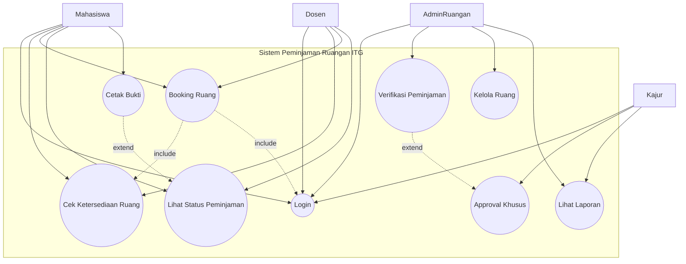
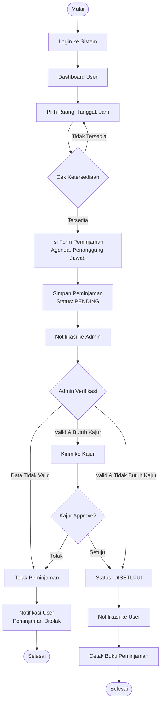
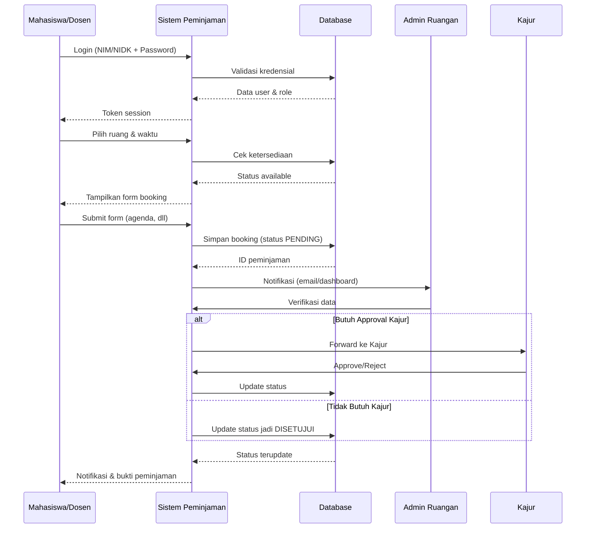
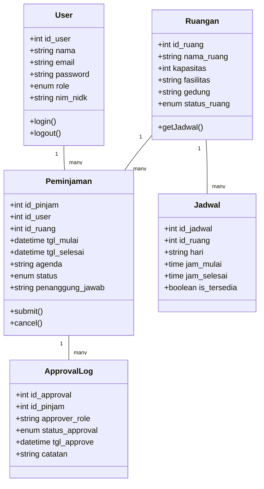
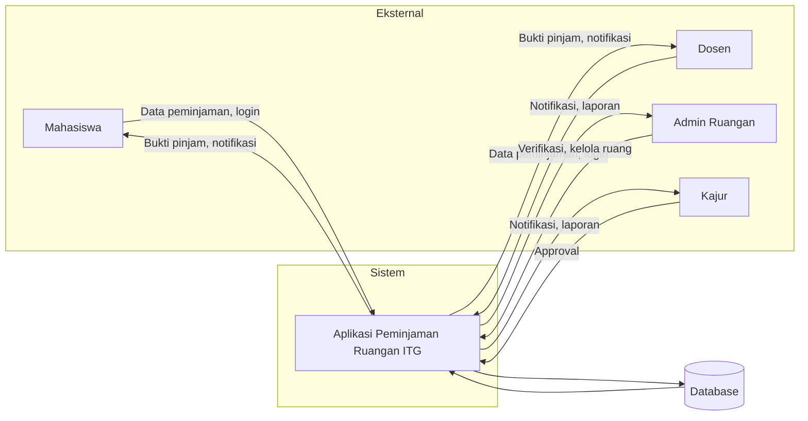
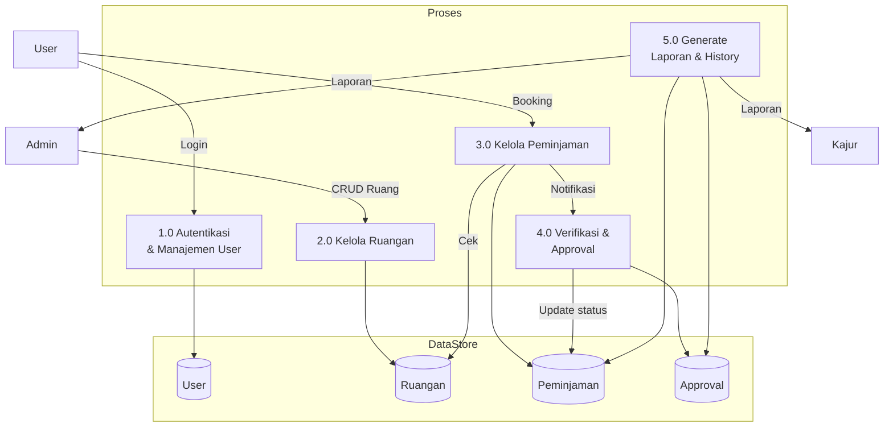
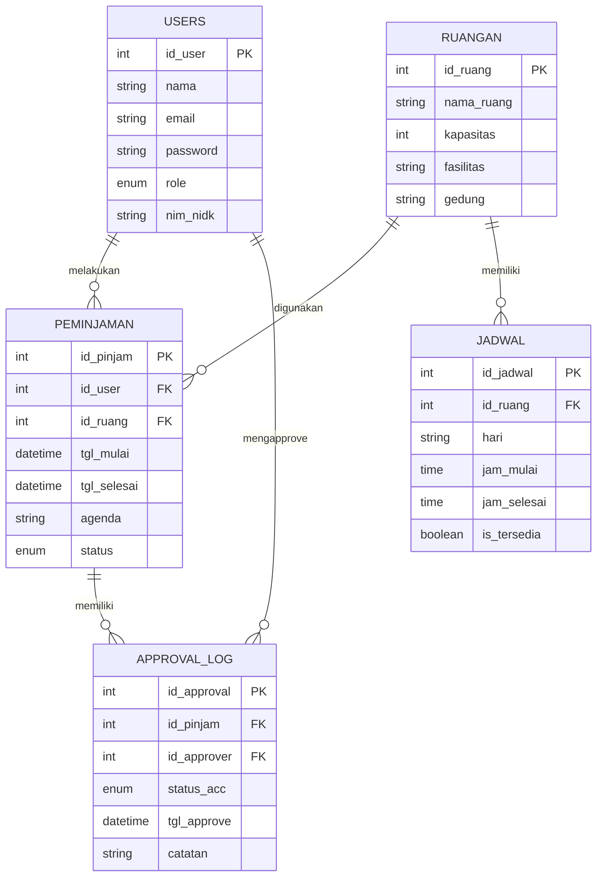
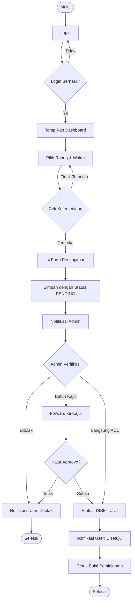
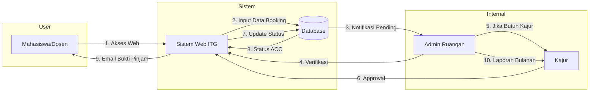
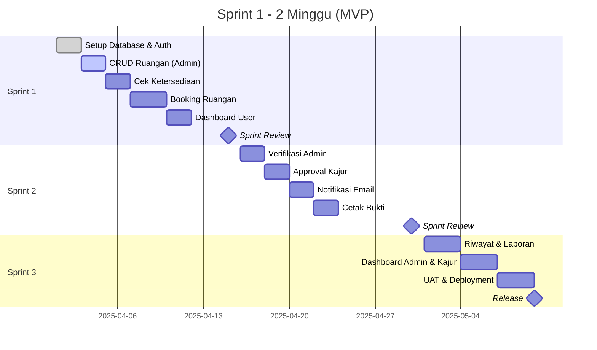

Berikut adalah semua diagram dalam format **Mermaid** yang bisa langsung kamu gunakan di Markdown (seperti di GitHub, Notion, atau VS Code dengan plugin Mermaid).

---

## 1. Use Case Diagram

---

## 2. Activity Diagram (Proses Booking)

---

## 3. Sequence Diagram (Booking)

---

## 4. Class Diagram

---

## 5. DFD Level 0 (Konteks Diagram)

---

## 6. DFD Level 1

---

## 7. ERD (Entity Relationship Diagram)

---

## 8. Flowchart (Proses Booking)

---

## 9. Flowmap (Alur Dokumen)

---

## 10. Sprint Backlog (Agile) dalam Mermaid

---

## Cara Menggunakan Mermaid

1. **GitHub**: Langsung tempel di README.md, akan otomatis render.
2. **VS Code**: Install extension "Markdown Preview Mermaid Support".
3. **Online**: Copy-paste ke [Mermaid Live Editor](https://mermaid.live/).

Apakah kamu ingin saya **menggabungkan semua diagram** ke dalam satu file markdown lengkap yang bisa langsung kamu download?